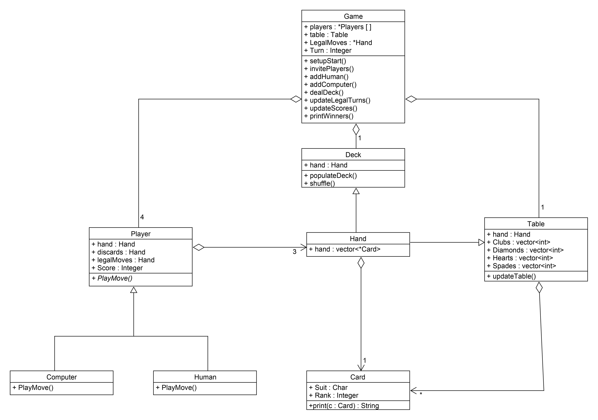

# Straights
## C++ Object Oriented Programing Card Game
### UML Diagram:

### Link to Demo:

## Design

In the player of the game straights, it was possible that the player was a computer or a human.
For each turn, I called a player method to play its turn. This method was virtual and was
overloaded using computer and human classes that were subclasses of the player. This is an
example of a template method design pattern. The player method was abstract with concrete
implementation from the subclasses human and computer.\
\
I also implemented the ability to quit the game from a player turn without leaking memory. This
was done by using smart pointers and ensuring all functions have a basic guarantee, so that when
the exception is thrown to quit the program it will not leak memory.\
\
In the game class a vector of pointers to the player class was used so that we could have both
players and computers. Since these were subclasses of players, we used polymorphism to allow
the game to have both.\
\
In the code, we also had many cases where there were many similarities among classes. For
example the deck, the cards players had in their hand, the discards, and the table closely
resembled each other but also had key differences. I used inheritance to reuse code for these
classes. This way they all had similar implementations but I could also add their own methods
and fields if need be.\

### More details of the project can be found in the 
